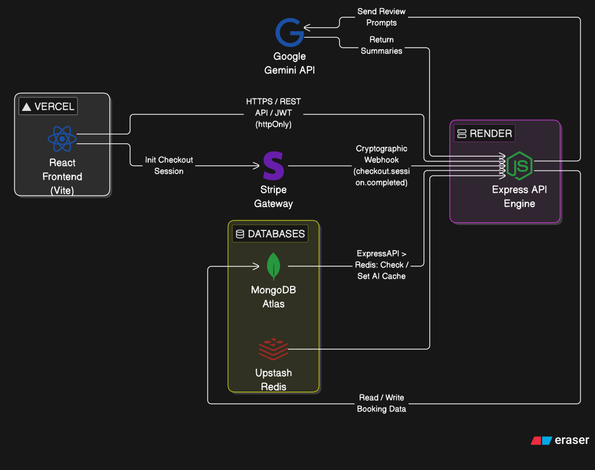

# DOMORA 

A high-performance, full-stack booking engine engineered with the MERN stack. Designed for scalability, this application leverages a distributed architecture, integrating intelligent AI data processing, Redis caching, and secure payment handling.

---

##  System Architecture

The application operates on a decoupled client-server architecture, enabling independent scaling and seamless deployment pipelines.

  

### Security & Data Flow
* **CORS Policies:** Configured strict origins to allow secure credential exchange between Vercel (Frontend) and Render (Backend).
* **Authentication:** Stateless authentication utilizing `httpOnly` JWT cookies configured with `sameSite: "none"` and `Secure` flags to prevent XSS and CSRF attacks.

---

## Engineering Highlights

### Optimized Frontend Performance
* **Dynamic Code Splitting:** Implemented route-level lazy loading using `React.lazy` and `Suspense`. 
* **Impact:** Slashed the initial JavaScript payload by **87%** (from 2.3MB down to 300kB), drastically improving Time-to-Interactive (TTI) and First Contentful Paint (FCP).

###  AI-Driven Insights & Caching
* **Generative AI:** Utilizes the **Gemini API** to dynamically parse and summarize user reviews into readable "Pros, Cons, and Ideal Guest" metrics.
* **Redis Caching:** Integrated **Upstash Redis** to cache AI-generated summaries. This eliminates redundant LLM queries, slashing endpoint latency by over 80% on repeat visits and optimizing API quota usage.

###  Secure Payment Pipeline
* **Stripe Processing:** Integrated Stripe Checkout for seamless transaction handling.
* **Cryptographic Webhooks:** Engineered a backend webhook endpoint (`/stripe/webhook`) to listen for `checkout.session.completed` events. 
* **Data Integrity:** The server cryptographically verifies the Stripe signature before automating the persistence of booking data to the MongoDB cluster, ensuring no fraudulent bookings bypass the gateway.

---

##  Tech Stack

| Category | Technologies |
| :--- | :--- |
| **Frontend** | React (Vite), Tailwind CSS, React Router |
| **Backend** | Node.js, Express.js, JSON Web Tokens (JWT) |
| **Databases** | MongoDB (Mongoose), Upstash Redis |
| **Integrations** | Stripe, Google Gemini AI, Cloudinary |
| **Infrastructure**| Vercel, Render, Git |
