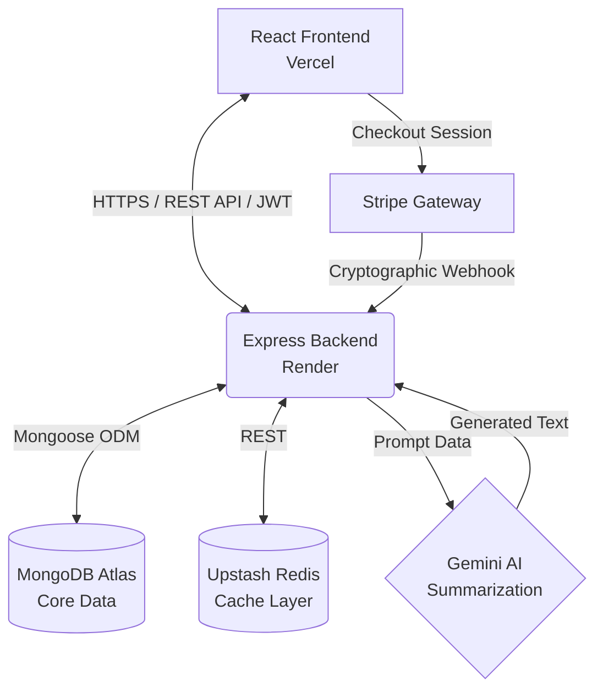

```mermaid
graph TD
    Client[React Frontend <br/> Vercel] <-->|HTTPS / REST API / JWT| Server(Express Backend <br/> Render)
    
    Server <-->|Mongoose ODM| DB[(MongoDB Atlas <br/> Core Data)]
    Server <-->|REST| Cache[(Upstash Redis <br/> Cache Layer)]
    
    Server -->|Prompt Data| AI{Gemini AI <br/> Summarization}
    AI -->|Generated Text| Server
    
    Client -->|Checkout Session| Stripe[Stripe Gateway]
    Stripe -->|Cryptographic Webhook| Server
```